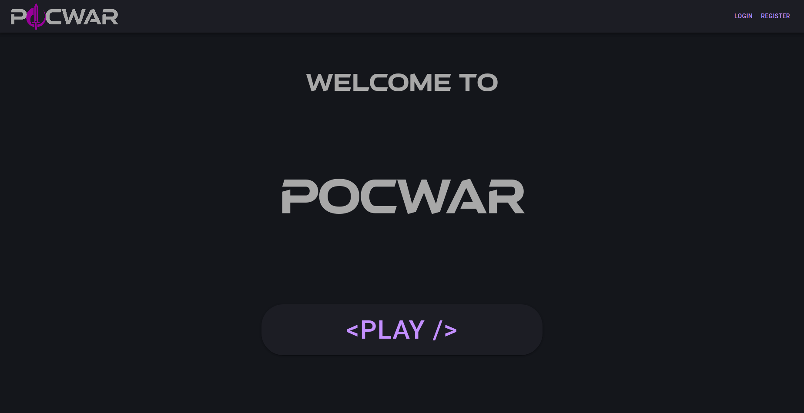
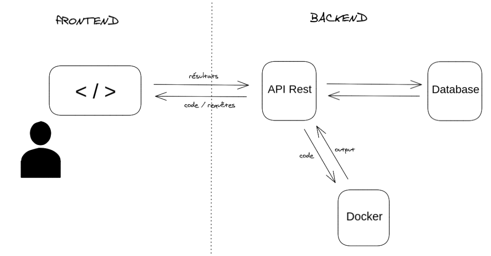
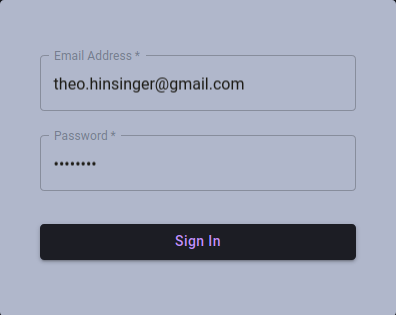
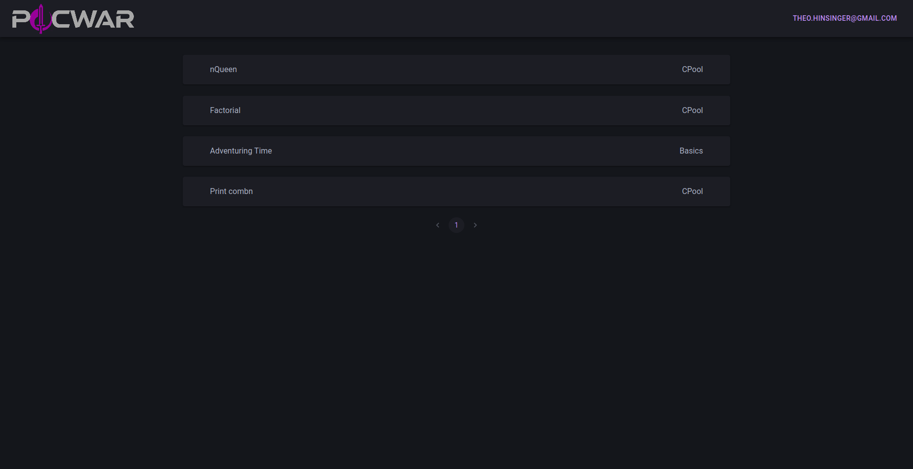
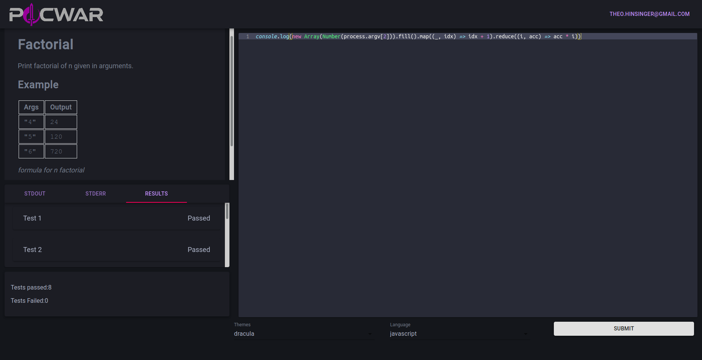
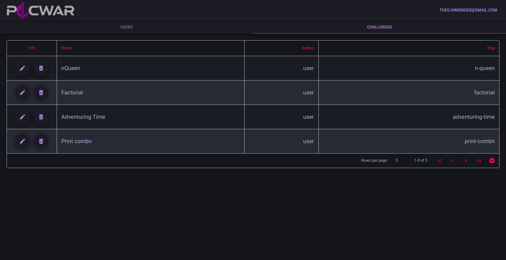
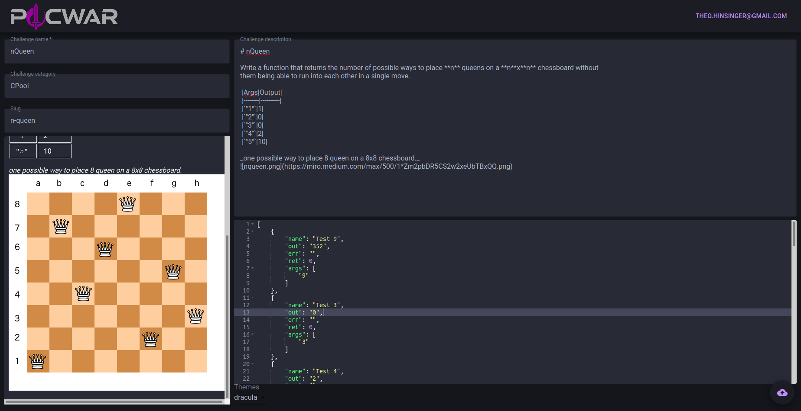

# PoCWar

La plateforme de PoC pour créer des challenges

React
Nestjs
Prisma
Postgresql
sql
Docker
markdown
material-ui
json
github
eslint
npm
nodejs
docker-compose
html
css
typescript
javascript
react-ace
bash
json
unit tests
react-hooks
react-hook-form
decorateurs javascript
class-validator
swagger pour la doc

langage supporté
c cpp go javascript python ruby rust

MVC

PoCWar est une plateforme en ligne permettant de réaliser des challenges de programmation créés en amont par les administrateurs de la plateforme.
Une fois connecté sur la plateforme, vous pourrez choisir un challenge, vous aurez alors une consigne avec une entrée d'exemple ainsi qu'une sortie d'exemple. Vous aurez un éditeur de code dans lequel il vous faudra rédiger votre programme.
Une fois le code réalisé, vous pourrez l'exécuter et voir sa sortie.

## Table of Contents

- pré requis
- installation
- architecture et fonctionnement

## Pré-requis

- Avoir git, npm et docker d'installé

## Installation

```bash
$ # Télécharger le repo
$ git clone git@github.com:PoCInnovation/PoCWar.git
$
$ # Utiliser un fichier de configuration local (a nommer .env)
$ mv example.env .env
$
$ # Lancer le projet (récupérer les images docker, lancer docker-compose)
$ npm run dev
$
$ # lancer le navigateur là où le server écoute (port 80 par défaut)
$ google-chrome localhost:80
```

## Architecture et fonctionnement



_Image 1: Écran de connection à PoCWar._

La plateforme est composé d'un front qui permet à l'utilisateur d'accéder aux challenges et de pouvoir envoyer son code pour le faire tester par le back.
Le back reçoit s'occupe de renvoyer les informations correspondantes des challenges qu'il aura précédement enregistré dans sa base de donnée. Il va aussi recevoir le code de l'utilisateur et l'éxecutera sous docker et renverra si l'utilisateur passe les tests ou non.



_Image 2: schema représentant l'architecture de la plateforme._

Pour pouvoir accéder aux challenges, chaque utilisateur dispose d'un compte. Il doit donc se connecter une première fois au site, et disposera ensuite d'un cookie qui fera en sorte de le connecter automatiquement à chaque visite du site. Ce cookie sera détruit si l'utilisateur vient à se déconnecter de son plein gré.



_Image 3: Écran de connection pour les utilisateurs de la plateforme._

Pour pouvoir accéder aux différents challenges une page listant tous les challenges existants est mise à disposition des différents utilisateurs. Les challenges n'ayant pas encore été réalisé sont grisé.



_Image 4: Écran de sélection des challenges._



La platefrome contient aussi un espace reservé aux administrateurs, pour qu'ils puissent créer et modifier les challenges ainsi que gérer les différents utilisateurs.


_Image 5: Pannel réservé aux administrateurs._


_Image 6: Écran d'édition des challenges, uniquement accessible aux administrateurs._
